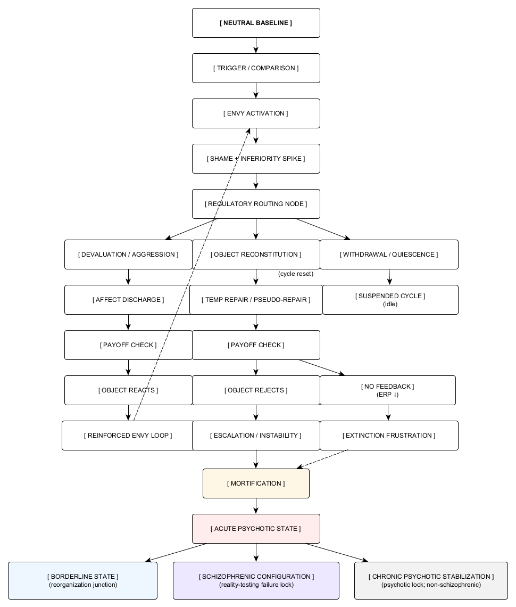

# Figure 1. The Pathological Envy Cycle

*Figure 1. The Pathological Envy Cycle.* The diagram depicts the invariant pathological envy cycle at the level of regulatory architecture. It represents routing logic and feedback conditions rather than diagnostic categories or affective states and is intended to be read as a structural map of possible pathways once the pathological envy mechanism is engaged.
