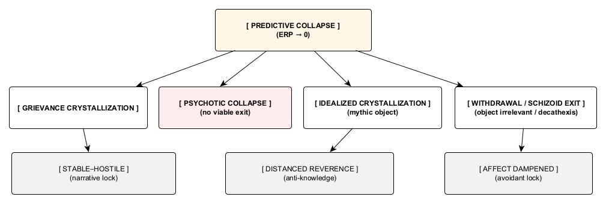

# Figure 1. The Pathological Envy Cycle

*Figure 2. Exit Pathways After Predictive Collapse.* The diagram depicts the primary structural routes available once predictive capacity collapses (ERP → 0). It represents terminal stabilizations and failure pathways rather than personality types or affective states, and should be read as a routing map of possible system-level outcomes following loss of predictive solvability.
