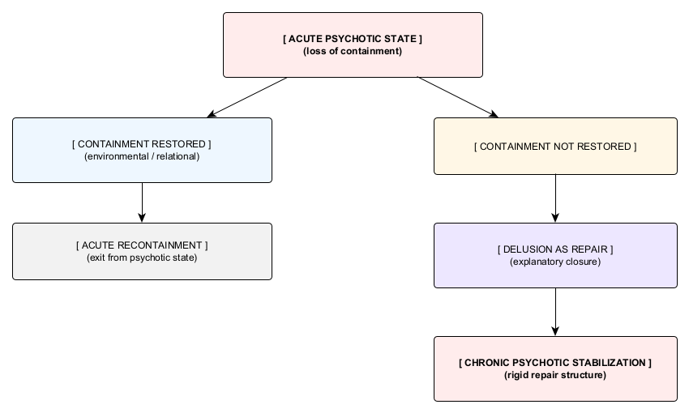

# Figure 3. Acute Vs Chronic Psychosis

*Figure 3. Acute vs. Chronic Psychotic Outcomes.* The diagram depicts containment-dependent branching within an acute psychotic regime. It distinguishes recontainment pathways from stabilizing failure outcomes based on whether containment is restored, and should be read as a conditional repair map rather than a diagnostic or temporal sequence.
