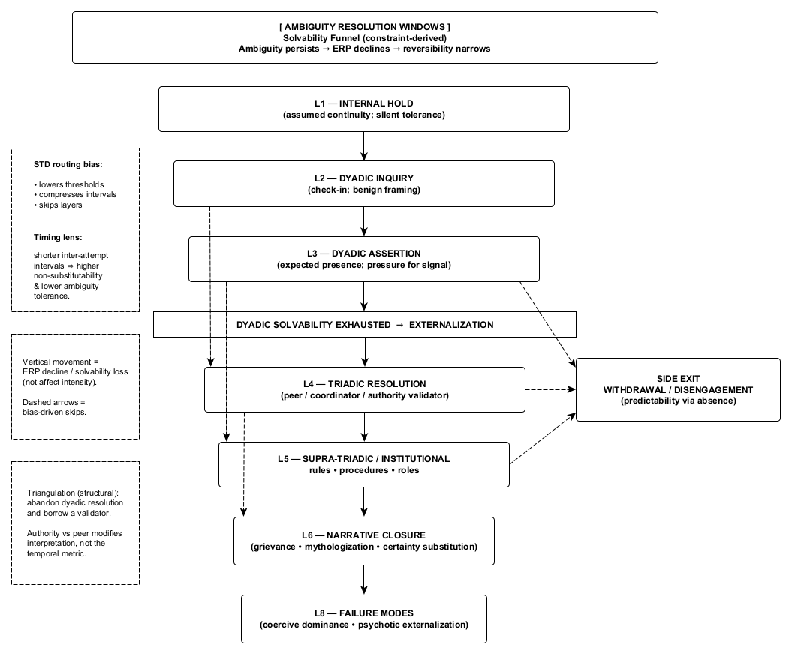

Figure 4. Ambiguity Resolution Windows and the Solvability Funnel
As predictive solvability declines following object withdrawal, regulation externalizes through progressively less reversible resolution mechanisms. Systems move through this space at different speeds and along different routes depending on constraint and state-transition bias; escalation reflects loss of solvability rather than increasing intent or affect. Ambiguity is represented as loss of connectivity or access between regions, not as a state or transition.
