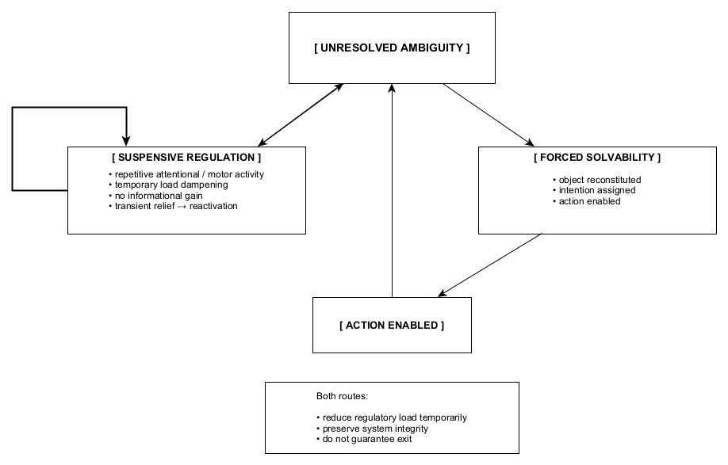

Figure 6. Ambiguity without exit describes a regulatory condition in which no available route produces legitimate resolution. Action is constrained, withdrawal fails to reduce load, and narrative collapse is either premature or too costly to sustain. The system remains active and regulated, but progress is suspended. This state is defined not by lack of information, but by the absence of an executable solution.
