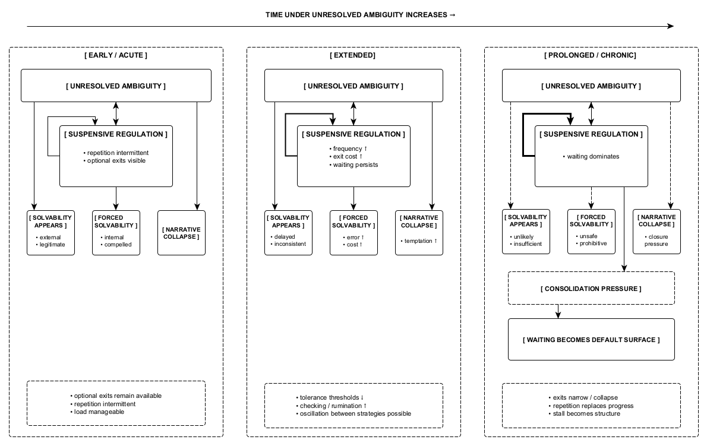

Figure 7. Time functions as a causal variable under unresolved ambiguity. As duration increases, tolerance thresholds lower, repetition frequency rises, and consolidation pressure intensifies. Acute, extended, and prolonged exposures differ not by mechanism, but by the viability of exits over time. Forced solvability emerges only after suspensive regulation fails under temporal compression, not directly from ambiguity itself.
