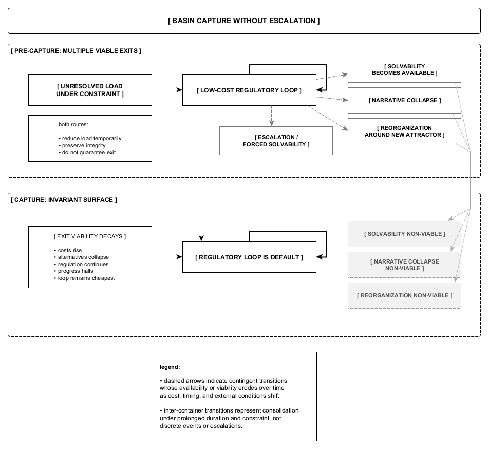

Figure 8. Under prolonged ambiguity without exit, suspensive regulation may consolidate into a stable surface. Repetition ceases to function as a bridge to resolution and instead replaces solvability itself. This basin capture occurs without escalation, collapse, or dramatic failure; regulation continues while progress halts, and alternative exits gradually decay.
