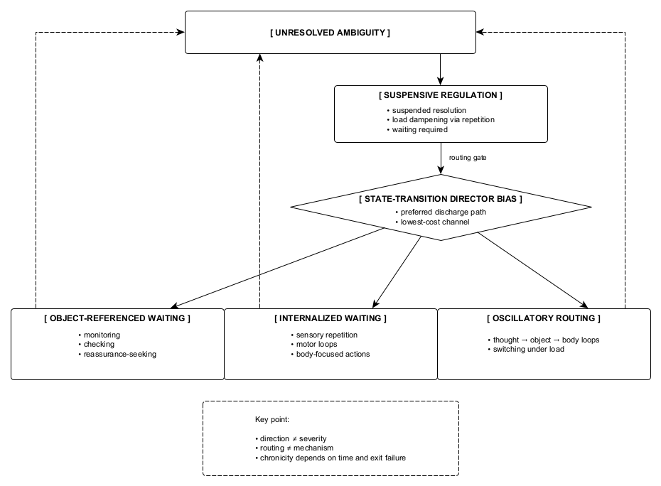

Figure 9. Suspensive regulation is a form of active regulation recruited under unresolved ambiguity. State-transition directors (STDs) determine how waiting discharges, routing regulatory load toward external monitoring, proxy engagement, or internal sensory repetition. These differences reflect directional bias rather than diagnostic category; the underlying structure remains identical despite divergent surface behaviors.
