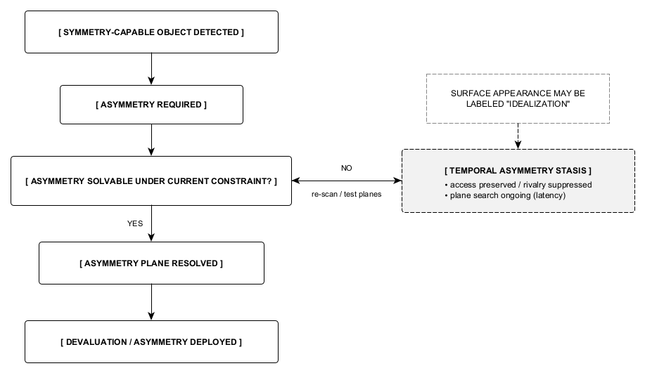

Figure 11. Temporal asymmetry stasis as a regulatory holding condition.
Following detection of a symmetry-capable object, asymmetry becomes required but may remain temporarily unsolvable, producing a holding condition in which rivalry is active but behavior is constrained to preserve access. This stasis persists until asymmetry becomes feasible or regulation reroutes, explaining why early behaviors may resemble idealization without reflecting valuation or placement.
