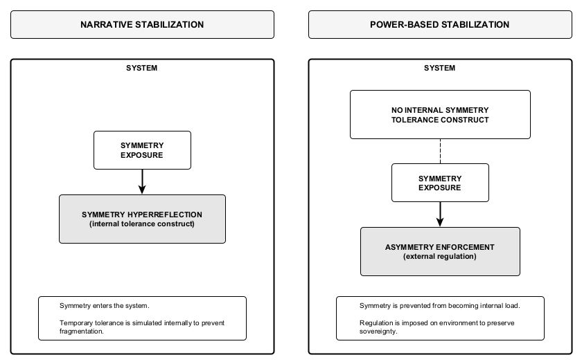

Figure 12. Internal versus external symmetry regulation.
Narrative stabilization tolerates symmetry internally through symmetry hyperreflection—an instrumental, symbolic construct that simulates maximal symmetry tolerance to prevent fragmentation while asymmetry remains unsolved. Power-based stabilization does not deploy internal tolerance mechanisms; symmetry is instead regulated externally through asymmetry enforcement, preventing it from becoming internal regulatory load. The contrast illustrates why symmetry hyperreflection is configuration-specific to narrative locks and structurally incompatible with power-dominant regulation.
