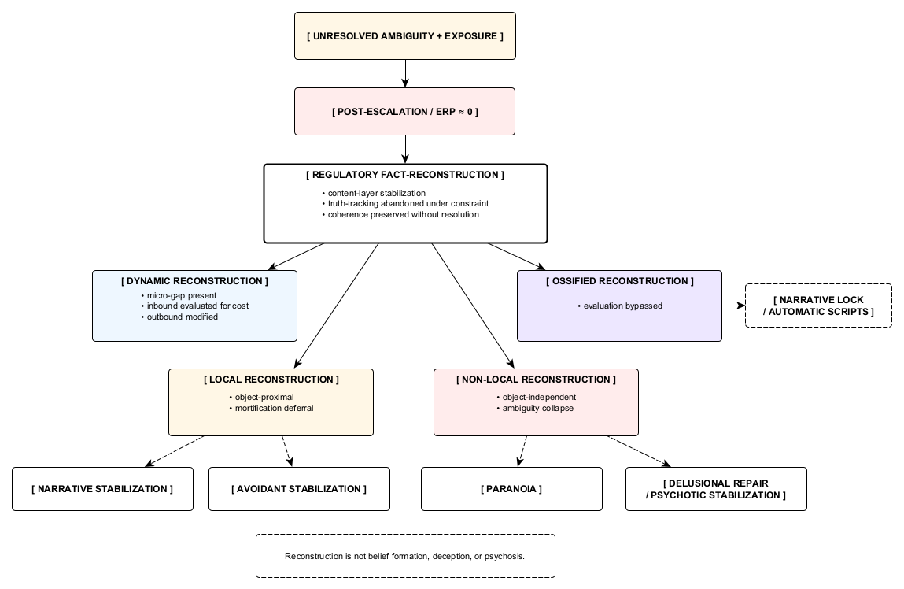

Figure 13. Regulatory fact-reconstruction as a post-collapse stabilization layer.
Following escalation failure, truth-tracking becomes regulatorily unsustainable and coherence is preserved through content-layer reconstruction rather than resolution. The figure differentiates dynamic and ossified forms of reconstruction, object-local mortification deferral versus non-local ambiguity collapse, and shows how this mechanism routes toward narrative and avoidant stabilization, paranoia, or psychotic repair under increasing constraint.
