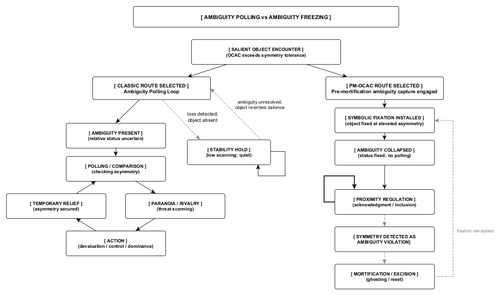

Figure 15. Ambiguity resolves through two non-equivalent regulatory logics: iterative ambiguity polling, which sustains evaluation and escalation under loss, and fixation-based ambiguity capture (PM-OCAC), which collapses evaluation by freezing symbolic roles and terminating polling.
