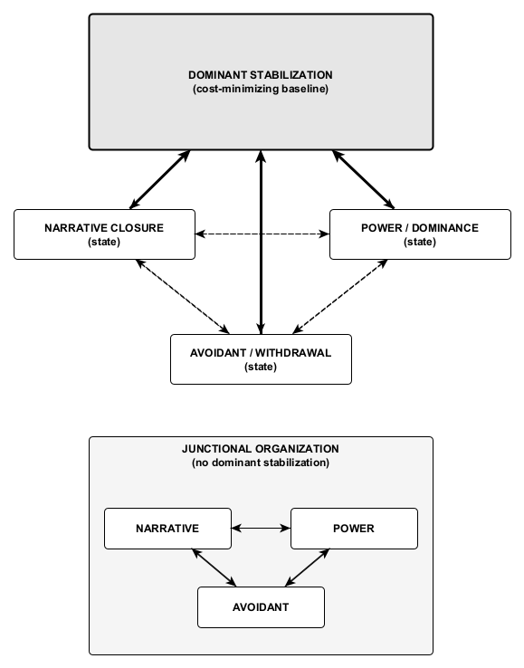

Figure 16. Dominant stabilization with state multiplexing.
Post-collapse systems may access multiple regulatory states (narrative closure, power/dominance, avoidant withdrawal) without possessing multiple stabilizations. The dominant stabilization is the cost-minimizing baseline that the system returns to most cheaply and reliably; multiplexed states are secondary deployments that remain viable only insofar as they do not destabilize the baseline. Cross-transitions between non-dominant states are possible but structurally costly, and sustained co-dominance fails to consolidate—yielding junctional oscillation (borderline organization) rather than durable reorganization.
