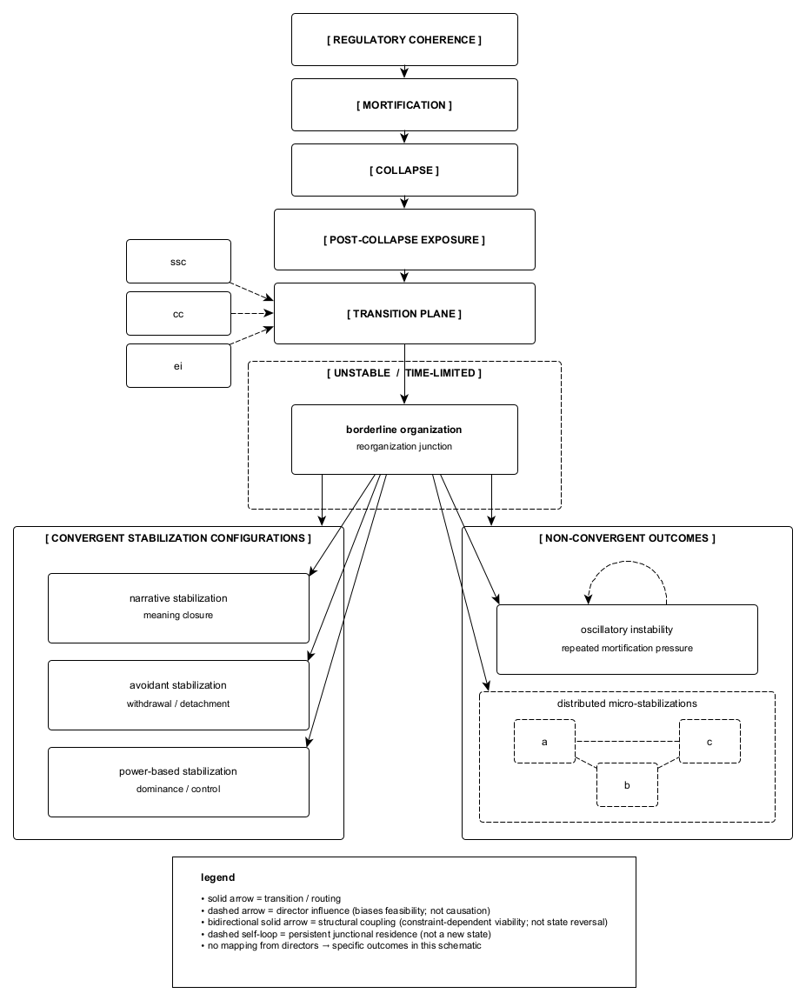

Figure A.1. Post-collapse reorganization topology illustrating the structural relations between collapse, exposure, constraint, and subsequent reorganization. Following collapse, reorganization is forced but routed through a transition plane biased by state-transition directors, without causal or terminal determination. Borderline organization functions as a junctional condition under instability, permitting convergence into locally absorbing stabilization configurations, persistence without convergence, or routing into non-convergent outcomes. Distributed micro-stabilizations reflect localized coherence under constraint rather than global consolidation. The topology depicts structural possibilities, not developmental sequence, severity, or outcome hierarchy.
