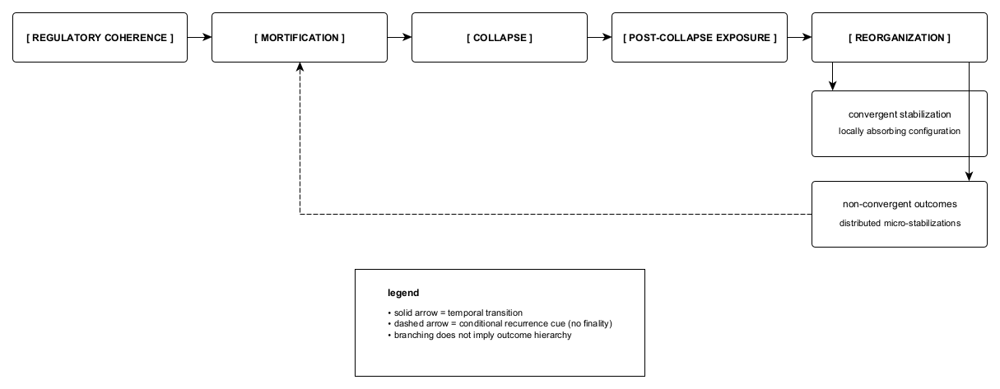

Figure A.2. Temporal sequence depicting regulatory coherence, mortification, collapse, and subsequent exposure requiring reorganization. Following collapse, systems enter a pre-organizational exposure phase in which reorganization becomes unavoidable, with possible routing toward convergent stabilization or non-convergent outcomes under constraint. Temporal ordering is shown without implying improvement, hierarchy, or terminal closure; recurrence and repeated exposure may occur without resolution.
