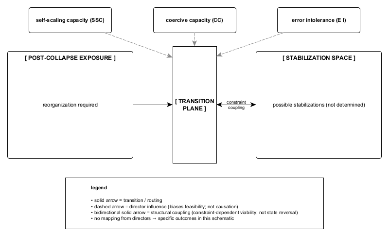

Figure A.3. State-transition directors bias feasibility at the transition plane without determining outcome. Self-scaling capacity (SSC), coercive capacity (CC), and error intolerance (EI) exert influence only at the point where reorganization becomes unavoidable, shaping which stabilization routes are energetically viable without mapping to specific configurations. The transition plane functions as a structural interface rather than a decision node; stabilization remains conditionally viable and subject to constraint coupling rather than terminal closure.
