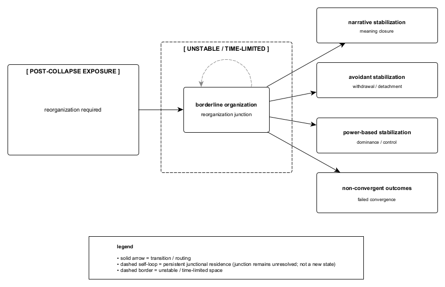

Figure A.4. Borderline organization functions as a junctional state following collapse, characterized by instability and unresolved routing rather than consolidation. Within this time-limited configuration, multiple stabilization routes remain viable, including convergent stabilization, persistent junctional residence, or transition into non-convergent outcomes. Borderline organization is not treated as an endpoint or identity, but as a transient structural condition that persists only so long as routing under constraint has not yet converged.
