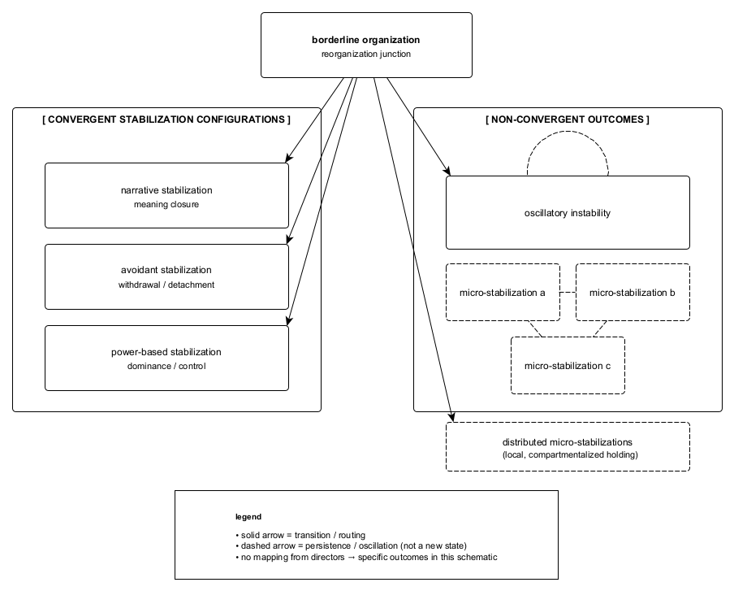

Figure A.5. Differentiation between convergent stabilization configurations and non-convergent outcomes following unresolved routing at the junction. Convergent configurations function as locally absorbing solutions under constraint, while non-convergent outcomes reflect ongoing instability or distributed micro-stabilizations without global consolidation. These outcome domains are structurally distinct and non-ordinal; neither implies severity, preference, or terminal closure.
