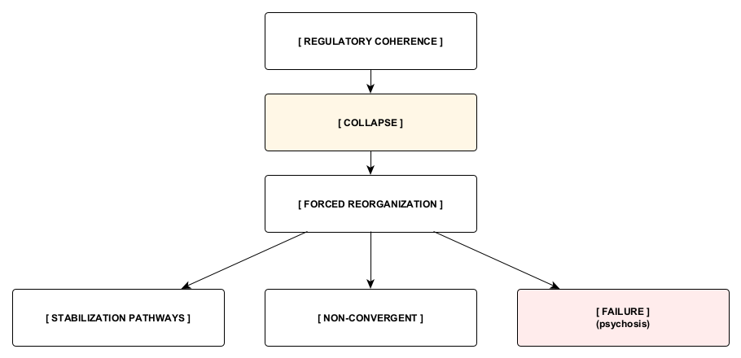

Figure 1. Post-Collapse Reorganization Topology
Loss of regulatory coherence produces collapse and forces structural reorganization. From this junction, the system may enter a stabilization pathway, remain non-convergent, or fail to establish a stable regulatory organization, represented here as psychosis. Stabilization denotes restored regulatory continuity, not necessarily resolution, integration, or psychological health. The branches represent possible structural outcomes rather than fixed developmental stages or inevitable progression.
