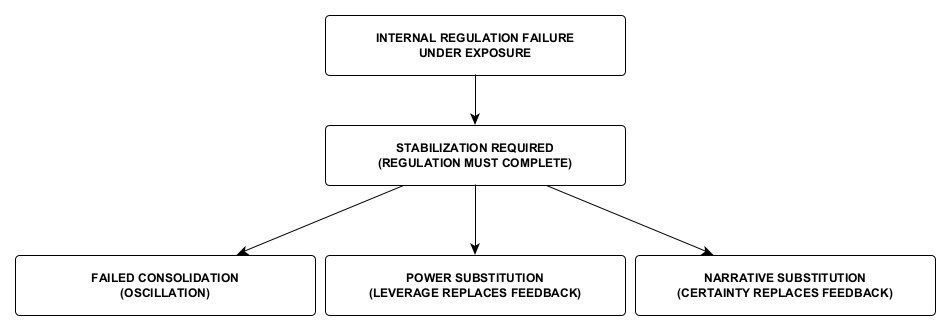

Figure 10. Stabilization Endpoints Under Constraint
When internal regulation fails under exposure, regulation must nevertheless reach completion. The available endpoint depends on the system’s remaining capacities and constraints: failed consolidation leaves regulation oscillating without stable completion; power substitution uses leverage in place of reciprocal feedback; and narrative substitution uses certainty in place of corrective feedback.
