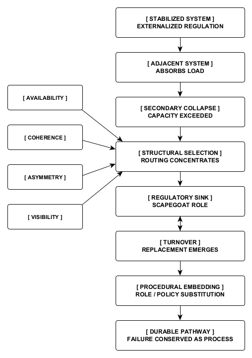

Figure 11. Propagation, Selection, and Institutional Stabilization 
A stabilized system that depends on externalized regulation transfers unresolved load into adjacent systems. When an adjacent system’s absorptive capacity is exceeded, secondary collapse initiates structural selection, with routing concentrated according to availability, coherence, asymmetry, and visibility. The selected system is installed as a regulatory sink or scapegoat role; turnover then produces replacement rather than correction. Once this substitution is embedded in roles, policies, or procedures, the original regulatory failure becomes a durable institutional pathway—conserved as process even as individual occupants change. The sequence describes structural propagation and does not require conscious coordination or intent.
