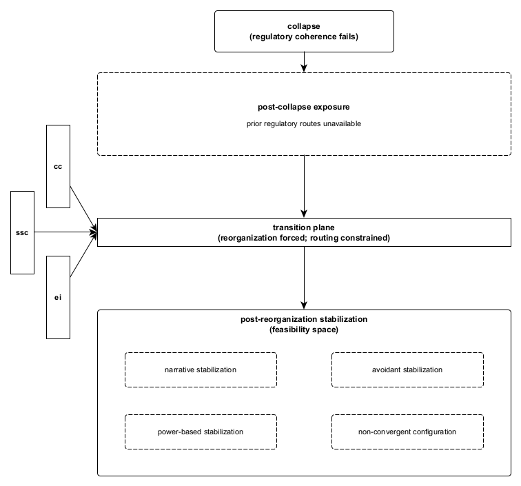

Figure A1. Post-collapse transition plane.
Following collapse of regulatory coherence, reorganization becomes unavoidable. Routing through the transition plane is biased by state-transition directors, which constrain feasibility without determining outcome. Stabilization emerges as a locally viable configuration under constraint rather than as restoration, choice, or resolution.
