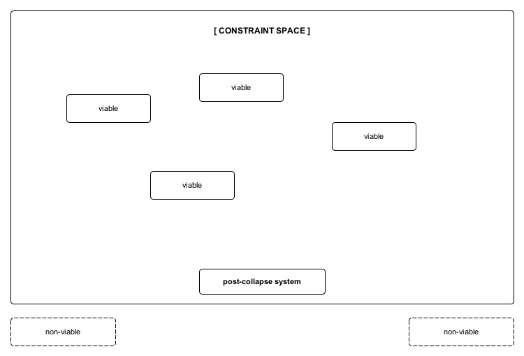

Figure A2. Constraint-limited outcome space.
Following collapse, reorganization does not occur across an open field of possibilities. The space of viable post-collapse configurations is constrained by pre-existing regulatory capacities, resulting in clustering within a finite outcome space. These constraints limit feasibility without selecting or prioritizing any particular configuration, accounting for patterned convergence without determinism.
