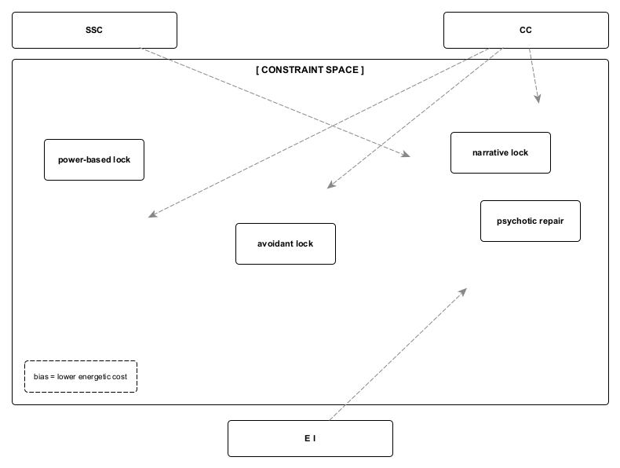

Figure A3. State-transition directors under constraint.
State-transition directors bias routing during forced reorganization by shaping which configurations are structurally accessible at the moment of transition. These parameters constrain feasibility without functioning as causes, traits, or outcome selectors, allowing identical collapse conditions to yield divergent stabilizations under different constraint profiles.
