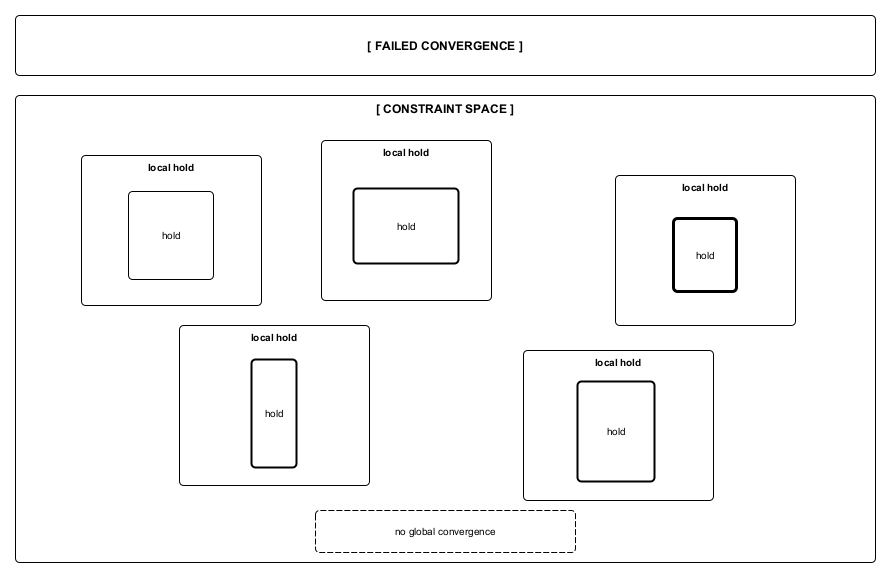

Figure A5. Convergent and non-convergent reorganization.
Post-collapse reorganization may yield either convergent stabilization or non-convergent configurations depending on constraint interaction and tolerance for internal inconsistency. Non-convergence reflects the inability to achieve global coherence under available constraints, rather than escalation, breakdown, or terminal outcome.
