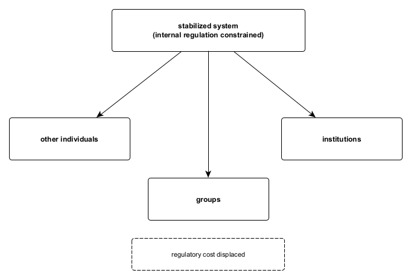

Figure A7. Regulatory externalization topology.
When internal regulation is constrained, regulation is not eliminated but displaced outward. Externalization occurs structurally, without intent or strategy, as regulatory cost is absorbed by other individuals, groups, or institutions. Causality remains upstream: downstream effects reflect the configuration of the stabilized system rather than deliberate action.
