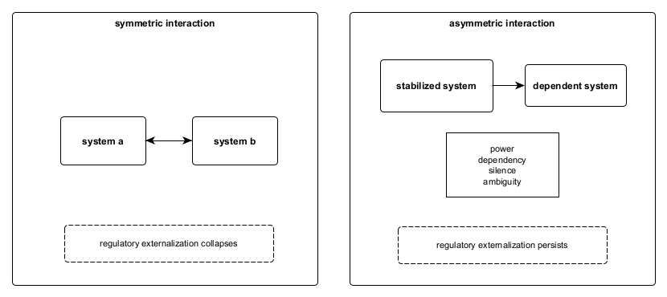

Figure A8. Asymmetry requirement map.
Regulatory externalization cannot be sustained under symmetric interaction. When interacting systems are structurally equivalent, feedback neutralizes displacement and regulatory effects collapse. Externalization persists only under asymmetry, where differences in power, dependency, silence, or ambiguity prevent reciprocal correction. Asymmetry here functions as a feasibility condition rather than a motive, strategy, or interpersonal choice.
