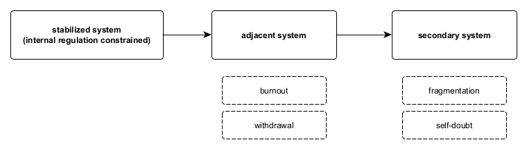

Figure A9. Damage propagation chain.
When regulatory cost is displaced outward from a stabilized system, downstream destabilization may occur in systems that absorb this load. Effects propagate sequentially rather than reciprocally: proximal systems exhibit strain-related outcomes such as burnout or withdrawal, while more distal systems may manifest fragmentation or self-doubt without direct contact with the originating source. Harm here is structural rather than intentional, arising from asymmetric absorption of regulatory burden rather than motive, aggression, or design.
