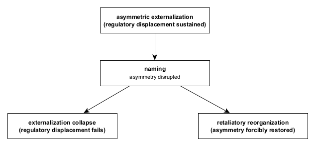

Figure A10. Naming / retaliation bifurcation.
When asymmetric regulatory externalization is explicitly named, the asymmetry sustaining displacement is disrupted. This perturbation forces reconfiguration, producing a bifurcation between collapse of externalization and retaliatory reorganization aimed at restoring asymmetry. Neither path implies correction or intent; both carry structural cost arising from the destabilization of previously viable regulatory routing.
