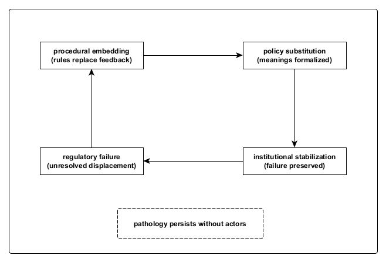

Figure A11. Institutional stabilization loop.
Within an institutional field, regulatory failure may become embedded in procedure and formalized through policy, producing durable stabilization without correction. This loop preserves function while preventing feedback, allowing pathology to persist in the absence of individual actors, intent, or oversight. Stability here reflects containment rather than repair, and endurance rather than consolidation.
